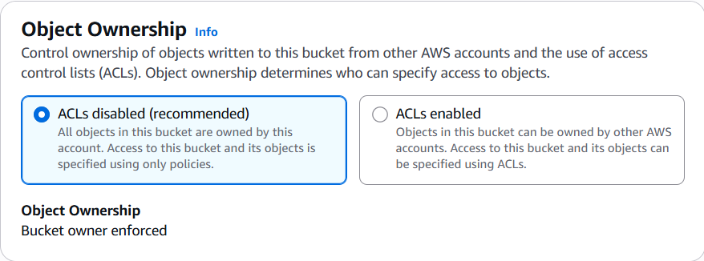
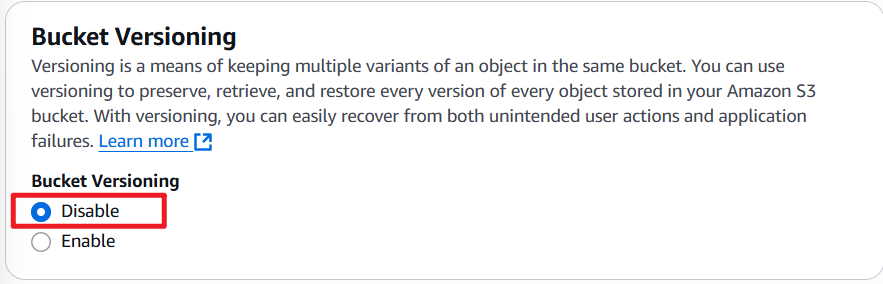
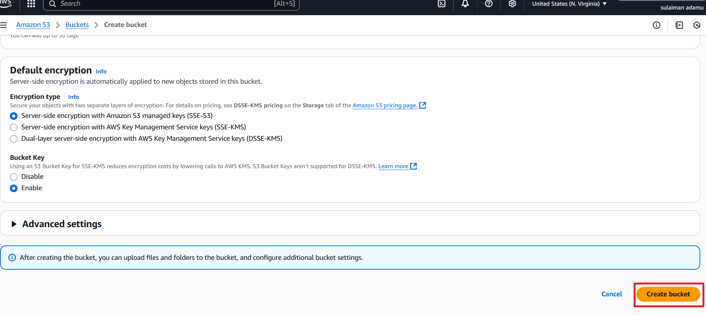

# Explain s3 bucket and show its being used

    We will be learning how to creat and manage buckets and cover topics like: 

- **BUCKETS**
- **OBJECTS**
- **VERSIONING**
- **PERMISSION**
- **lifecycle policies and data management**

what is Amazon S3?

S3 as the name suggest is triple S we can say 3S but the name on amazon is S3 which stands for `Simple Storage Service`. Its like a big warehouse where we can store all kinds of data on AWS. It can hold files of any type, pictures, videos and so on. as long as the data is moveable S3 can store.


    S3 is a super reliable and secure service, cause your data is stored across multiple servers in different locations, so even if something goes wrong with one server the data is readily available in other servers across the region or in another region if we enable cross-regional-replication.
    S3 is flexible and allows access to files via internet from any part of the world and allow the bucket owner to control who can see and edit the content of the bucket with different permissions.

## Benefits of S3

- allows automatic scalabiling.
- it is durable and reliable.
- data can be accessed from anywhere.
- data stored in s3 are secured.
- data retrieval time for all data of same size is the same no matter how nested the file is. This is because no file is truely nested in aws as it uses flat file system, instead names are structured in such a way it looks like it belongs to a subfolder. AWS console will display object as nested by they actually ain't.

## S3 use cases

- Backup important data.
- how website assets such as images and icon.
- S3 in combination with cloudfront delivers data to users with very low latency.

## S3 Core Concepts

- **Buckets**: this is a folder or a container which can hold data of any kind, it must have a globally unique name meaning no two buckets in the world can have the same name. it also has unlimited size.

- **Object**: is the general name given to data stored in S3 bucket. it can be file, photos, videos and so on.


- **Keys**: are unique identifier for an object in a bucket. they are like file names with the complete file path.

- **Storage Classes**: are various types of S3 buckets which are classified by how fast data can be extracted and how often data are extracted from a bucket, this . e.g Standard, Standart-IA(infrequent Access), One Zone-IA, Intelligent-Tiering, Glacier, and Glacier deep Archive.

- **Access Control**: control who can access objects in S3 using Access Control List(ACLs) and Bucket policies. you can also use IAM to manage access to user or group.

**Data transfer**: S3 supports both inbound (upload) and outbound (download) data transfer. You can transfer data to and from S3 using various methods, including the AWS Management Console, CLI(command line interface), SDKs (Software Development Kits), or third-party tools.
 
**Durability and Availability**: S3 is designed for 99.999999999(11 nines) durability, meaning your data is highly resistant in loss, it also offers high availability, ensuring that your objects are accessible whenever you need them.

**Versioning**: S3 Versioning allows you to keep multiple versions of an object in the same bucket. This feature helps protect against accidental deletion or overwrite, as you can restore previous versions of an object if needed. versioning stores an object even after deletion and can be easily recovered.

## Enough theory Lets do some practical

`task` :

- Create a new S3 bucket to store files
- Upload a file into the newly created bucket
- Enable versioning for the bucket
- Configure the permissions for the bucket to enable public access,
- ensuring that the files can be accessed by anyone with the appropriate like.
- Implement lifecycle policies to automate the management of our files.

### Create S3 bucket and store a file in it

Quick search for S3 in your AWS account and select S3


Start creating the bucket

- Name the bucket with unique name following Aws bucket naming convention


- Determine access control list type for the bucket(ACLs)



- Determine how the bucket can be accessed


- Disabled versioning of the bucket



- Create the bucket, here you might find out your bucket name isn't unique, my advice is simply add more numbers to it.



- Created successfully message


- Click on the created bucket name lets upload a file to it.


- Create the file on the local machine to be uploaded


- select file for upload


- Successfully uploaded the file message


### Enable Versioning

lets see the current state of our version


click on `edit` which can be found on the top right.


update the file and reupload it.


display the versions of the file by clicking `show version` as highlighted in this image.


### Creating permission

in the bucket permisson, change the access to allow public access


define what the public can do to the bucket by clicking on bucket policy


generate the bucket policy using an aws policy generator


before clicking on generate policy here, click add statement to 
this will basically allow the creation of more than one policy and its important for the generation of any policy. 


Now click the generate policy, a window will pop up containing a json syntax like this;

```javascript
{
  "Version": "2012-10-17",
  "Statement": [
    {
      "Sid": "Statement1",
      "Effect": "Allow",
      "Principal": "*",
      "Action": [
        "s3:GetObject",
        "s3:GetObjectVersion"
      ],
      "Resource": "arn:aws:s3:::testing-bucket-creation675/*"
    }
  ]
}
```

past the policy in the bucket policy windown as shown below and save changes;


Click the file uploaded name now and copy the URL to a browser. this will automatically download a copy of the file like in my case. it can also open it in some browser though depending on settings.
Every version of the file has different URL. so they are different files too.

### Lets Learn about Lifecycle policies